GUARDAR DONDE IMAGENES DESPUES

**asdasdsa**
[hola](https://google.es)

    if(noRespeto){
        alert("adios");
    }

|hola   |adios |uno |
| - | - | -:  |
|1      |2  |3      |
|2      |1  |4      |

# Despliegue de aplicación Web con Laravel en Docker:
  
## 1. Paso mas difícil, Instalar laravel :

- Creamos nuestro directorio
- Entramos en él
- Realizamos un git clone de entornods con sudo

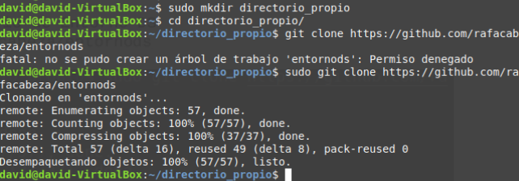

- Entramos a entornods
- Cambiamos de rama a laravel

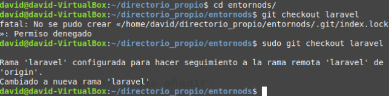

- Levantamos el docker

- Salimos de todos los directorios

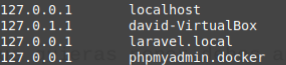

- Entramos a /etc/hosts

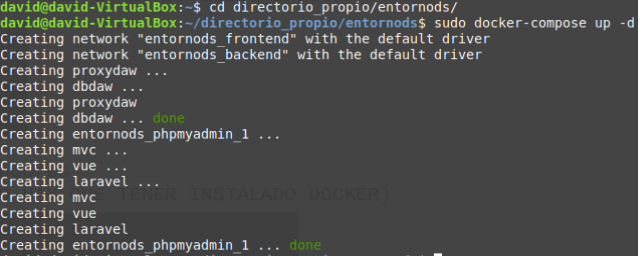

- Introducimos las direcciones con los puertos enseñados

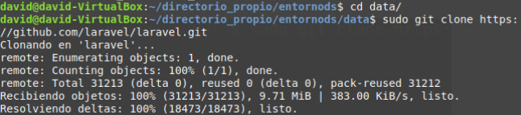

- Entramos a data
- Clonamos mediante git nuestro laravel

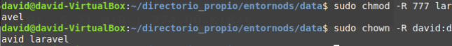

- Otorgamos permisos sobre la carpeta laravel a todos los usuarios -Nos hacemos dueño del directorio laravel

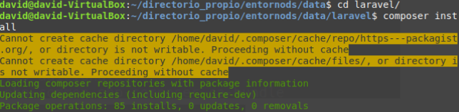

- Entramos a laravel
- Realizamos el composer install (si no esta instalado sudo “apt-get install composer”)

- Tras 5 minutos, si no hay ningún error recibirás este mensaje:

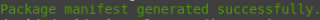

- En la carpeta laravel, copiamos el archivo de configuración y le damos otro nombre a la copia
- Generamos la clave de nuestra aplicación

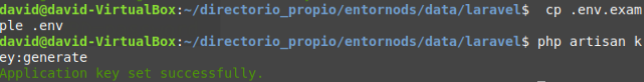

- Modificamos dicho archivo

- Volvemos al directorio entornods
- Reiniciamos docker por seguridad

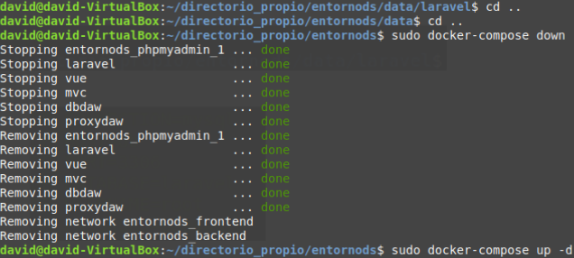

- Vamos a nuestro navegador y en laravel.local ya estará nuestro laravel ya operativo.
## 2. Despliegue Final
- Accedemos mediante Atom por ejemplo, en el directorio	routes tenemos el archivo web.php donde pondremos que si el usuario introduce laravel.local/DespliegueLaravel le devolverá una vista con 	“hola que tal”.

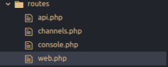

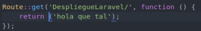

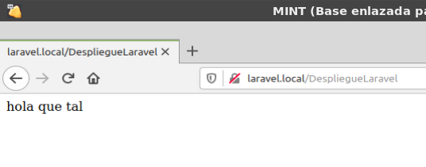